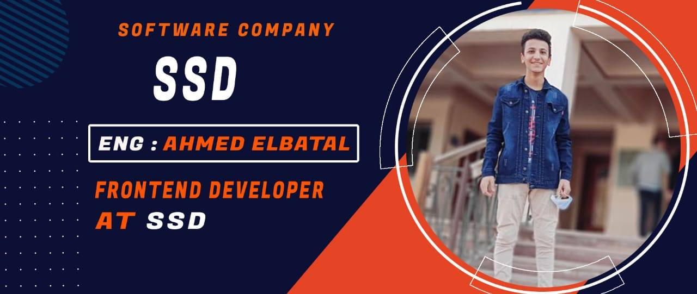

### Hey there 👋
 * 👨 My name is __Ahmed Elbatal__, I am from Egypt and I am 17 years old.
 * 💻 I am a Front-end Developer.
 * 🔎 I am looking for job opportunity.

### My Skills
##### Coding Languages:
Php, C++, Java, Html, Css, JS(oop, Dom, Bom, Es6).

##### Frameworks/Systems: 
Canvas, SVG, Ajax, Json, Dealing The Api, JQuery, Bootstrap, Sass, Pug.js, Vue.js, Vuex.
Git, Github, Slack, Visual Studio Code, PhotoShop, Adobe XD, Ui/Ux Design.

### Career Summary
##### Front-end Developer At SSD Co.
 * Designs and creates software solutions to solve pain points for various clients.
 * Developed and implemented software solutions based on client requirements.
 * Experience in dealing with teams.
 * Create a Simple Sites.

##### TeamLeader At 1Million Egyption Coders. 
 * Experience in dealing with teams
 * Visual content provider

### Contact Info
[Email](aelbatal33@gmail.com)\
[linkedin](https://www.linkedin.com/in/ahmed-elbatal-009b971a4)\
[facebook](https://www.facebook.com/aelbatal33)\
[Ahmad Elbatal](https://ahmedelbatal.netlify.app/)\
[My CV](assets/myCV/AhmedElbatal-cv.pdf)

📱 01155865821

> My pc is my friend I talk to him a lot.
